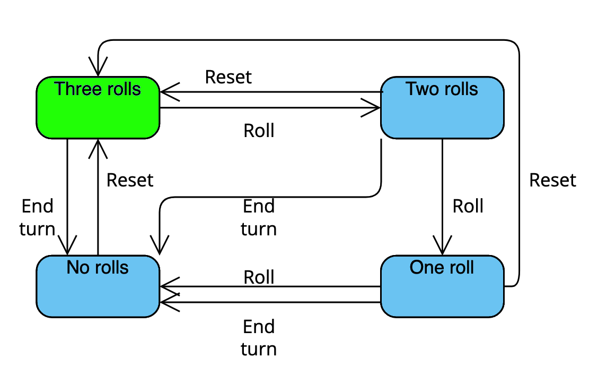

# Learning functional and concurrent programming concepts with Elixir

## Introduction

If you are early in the process of learning Elixir, or if you are considering learning it in the future, you may have wondered what the experience is like, how easy it is to pick up functional and concurrent programming concepts when coming from a background in languages which lack those features, and which aspects of the language are the most challenging for newcomers to learn.

In the following article, I will relate my experience as a new Elixir developer working to implement the dice game Yatzy as my first significant project with the language. In my education and career thus far I have worked primarily with Java, and therefore this project was my first extensive exposure to concepts such as recursive functions, concurrent processes, supervision trees, and finite state machines, all of which will be covered in more depth through the remainder of the article.

## The rules of Yatzy

Yatzy is a variation of Yahtzee, with slight but notable differences to the rules and scoring. Players take turns rolling a set of five dice. A player has the option to choose any number of their dice to re-roll up to two times each turn; after this, they must choose one of fifteen categories to score in. The “upper half” of the scorecard consists of six categories, “ones” through “sixes”, the score for each simply being the sum of all dice with the specified number. The “lower half”, consisting of the remaining nine categories, has more specific requirements, such as “two pairs”, “three of a kind”, “full house”, etc..

If a player’s total score in the upper half is equal to or greater than 63 they receive a 50-point bonus, and the player with the highest total across the whole scorecard once all categories have been filled is the winner of the game. A more thorough explanation of the game’s rules can be round on the Wikipedia page for Yatzy.

## Requirements of the project

Given this ruleset, a functioning implementation of Yatzy would need to do the following: simulate dice rolls including those where certain dice are kept for subsequent rolls, calculate the score a roll would result in for each category, save each player’s scorecard throughout the entire game, determine the winner at the end of the game, and allow the players to take these actions via a simple UI.

Due to my object-oriented background, my approach to this project in prior years would be to define classes to represent relevant concepts such as the player, the scorecard, and the roll, and maintain the state via instances of these objects. Additionally, I would make sure of iteration via loops to traverse data structures. Working with Elixir requires these problems to be tackled in different ways; the concepts are instead represented by processes which can be run concurrently, and data structures are traversed with recursive functions. Adapting to this different structure and way of thinking was the most challenging and also most rewarding part of this project.

## Score calculations and pattern matching

My first step in writing the project was to implement functions for rolling a set of five dice, and calculating the potential scores of those dice rolls in each available category. The dice roll itself was fairly simple, but makes use of a notable feature of Elixir that I had not previously encountered: setting a default argument for a function. In this instance, the roll function takes a single argument, ‘keep’, representing the dice from a previous roll that the player has chosen to keep.

```elixir
def roll(keep \\ []) do
  dice = 1..6
  number_of_dice = 5 - Enum.count(keep)
  func = fn -> Enum.random(dice) end
  roll = Stream.repeatedly(func) |> Enum.take(number_of_dice)
  keep ++ roll
end
```

Here ‘keep’ has a default value of an empty list that will be used if ‘roll’ is called with no arguments, as it would be for the first roll in any turn. If a list is passed to ‘roll’, the function will only generate enough new numbers to fill out the rest of the roll, and then combine this list with ‘keep’ for its final output. This allowed my code to be simpler, defining one function head that could be used in multiple different scenarios.

The score calculations themselves were far more complex, and required making use of Elixir’s pattern matching capabilities. In this case, testing for a valid score in each category required accounting for every possible configuration the dice could appear in when passed into the function. I was able to greatly reduce the number of cases by ensuring the dice were sorted descending when passed, but this still left a lot to account for. However, Elixir’s pattern matching makes this process easier than it would be otherwise: the cases can be handled entirely in the function heads, and each function can be written in a single line:

```elixir
def two_pairs([x, x, y, y, _]) when x != y, do: x * 2 + y * 2
def two_pairs([x, x, _, y, y]) when x != y, do: x * 2 + y * 2
def two_pairs([_, x, x, y, y]) when x != y, do: x * 2 + y * 2
def two_pairs(_roll), do: 0
```

An easy error to make here is failing to specify that the two numbers must be different from each other in the case of “two pairs” and “full house”; if the “when” is not included then a roll of 6, 6, 6, 6, and 5 would be valid for “two pairs”, in contradiction of Yatzy’s rules.

## Processes and GenServers

The next step of building the game was to implement processes, starting with those for the player and the scorecard. Processes in Elixir are vital for maintaining state and allowing concurrency - as many of them can be run simultaneously, I was able to set up a process for each player in the game, and one for the scorecard belonging to each of those players, as well as one more to handle the score calculations.

As processes are dissimilar to the object-oriented model, they were the aspect of Elixir that took me the longest time to adjust to. I became comfortable with them by first learning how to work with raw processes, in order to better understand the theory behind them. After this, I converted these processes into GenServers, which contain improved functionality and handle most of the client/server interactions automatically.

## The supervision tree

Another benefit of GenServers over raw processes is that they can be used as part of a supervision tree. In Elixir, a supervisor is a process that monitors other processes and restarts them if they crash; a supervision tree is a branching structure consisting of multiple supervisors and their child processes. In my Yatzy application, the supervision tree consists of a head supervisor with the score process as a child, along with another child supervisor for each player in the game. Each of these player supervisors has two children: a player and a scorecard.

Due to supervisors being syntactically similar to GenServers, the majority of this step of the process was simple, as I had already learned how to implement the relevant API and callback functions. However, one mistake that took some time to notice was accidentally using GenServer.start\_link instead of Supervisor.start\_link in the API for the player supervisor. This problem was particularly hard to diagnose as it resulted in no compile or runtime errors in the application, but did result in the supervisor’s child processes not starting, and thus the game not functioning.

## Finite state machine

After setting up the supervision tree, I still needed to define one more process to handle the functions for running through a single player’s turn. This process was implemented as another child of the head supervisor. As this process needed to handle multiple different states representing different stages of the turn, I constructed it as a finite state machine using the GenStateMachine module.



In this case I defined four states, representing how many rolls are remaining in the turn: three, two, one, and none. It contains functions handling calls that represent a roll of the dice, which will set the machine to its next state, and functions that will reset it to its initial state for the end of the turn, including if the player decides not to use all their rolls. Below is an example of one of the calls, representing a player making their second roll in a turn.

```elixir
def handle_event({:call, from}, {:roll, keep}, :two_rolls, data) do
  data = data ++ keep
  {:next_state, :one_roll, data, [{:reply, from, data}]}
end
```

Compared to learning how to work with GenServers and Supervisors, this functionality was actually rather simple to pick up. I had never worked with finite state machines in other languages, but the examples of GenStateMachine in the Elixir documentation were easy to understand and contained all the information I needed in order to implement this process.

## User interface and recursion

Once the required processes were in place in a supervision tree, it was time to implement a simple text-based interface allowing a full game of Yatzy to be played all the way through. This would require each player in turn to receive the results of a dice roll, be prompted to choose which, if any, dice to keep for their subsequent rolls, and then again prompt them to choose which category to score in for that turn. It should loop through the players in this way until the game is complete, at which point it should declare the winner and prompt the user to reset the scorecards and play again.

Implementing the interface was the most complex and time-consuming part of the project, requiring a significant amount of trial-and-error and researching through the Elixir docs in order to get something functioning. One aspect that was easier than expected, however, was working with recursive functions. I had rarely used recursion while working in Java due to the language’s focus on iterative loops, and as such never became fully comfortable with the technique. Implementing the interface required me to use recursion in several different places, and I was surprised at how easy it was to pick up in this language, with the pattern matching on function parameters making it simple to account for the end of the loop. The following is one of the recursive functions I implemented, which maps the results of a dice roll to the letters a, b, c, d, and e, allowing the player to pick which of the five they want to keep in the text-based interface.

```elixir
def map_dice([], _indexes), do: []
def map_dice([head | tail], indexes) do
  index = String.to_atom(head)
  key_in_indexes = Map.has_key?(indexes, index)
  case index do
    index when key_in_indexes ->
      value = Map.get(indexes, index)
      [value | map_dice(tail, indexes)]
    _index ->
      [map_dice(tail, indexes)]
  end
end
```

## Future

Although my Yatzy implementation is currently functioning correctly, I plan to extend the project further in the future. In the current version, only three players are supported, with their names hard-coded into the program. I would like future versions to have a dynamic amount of players, along with the ability for the players to specify their own usernames.

Additionally, I am also planning to learn the basics of Phoenix LiveView in the near future. Once I have done this, I would like to write a frontend for the program, allowing the players to interact with a more readable and visually appealing graphical interface rather than the current text-based version.

## Conclusions

Overall, I would describe my experience with the project as positive, and feel that it served as a good introduction to Elixir. I was able to learn many of the basic features of the language naturally in order to fulfil the requirements of the game, and adjusted my ways of thinking about programming to more better suit working with functional and concurrent programs. As a result, I feel like I have a good understanding of the basics of Elixir, and am more confident about my ability to carry out other work with the language in the future.

## References

[Yatzy implementaion on Github](https://github.com/rhysdavey/yahtzee)

[Yatzy on Wikipedia](https://en.wikipedia.org/wiki/Yatzy)

[GenServer on Elixir docs](https://hexdocs.pm/elixir/1.13/GenServer.html)

[Supervisor on Elixir docs](https://hexdocs.pm/elixir/1.13/Supervisor.html)

[GenStateMachine on Elixir docs](https://hexdocs.pm/gen_state_machine/GenStateMachine.html)
